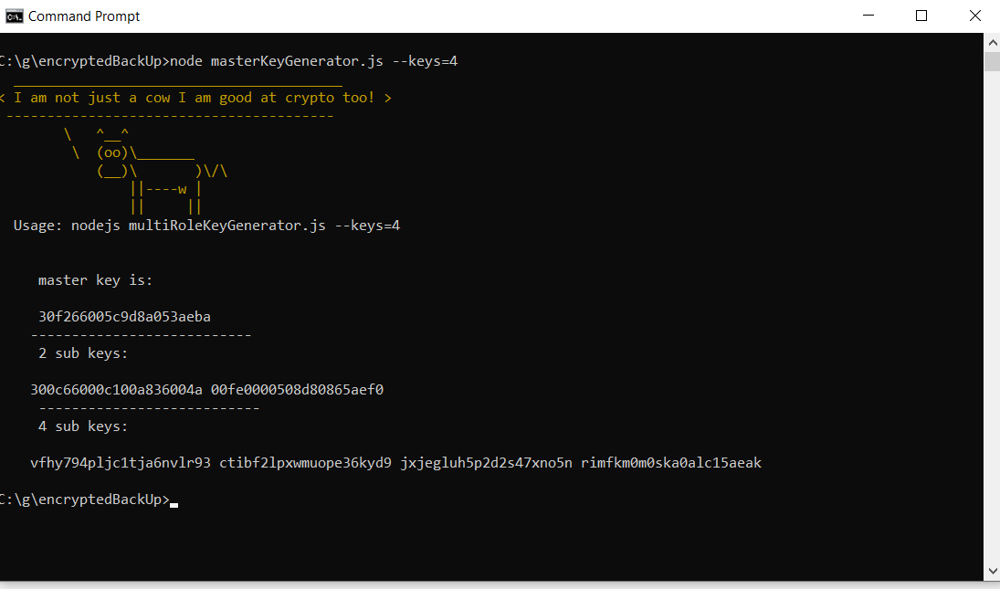

# masterKey-generator
JS script to create a master key from sub keys. 




## Usage 
```
C:\g\encryptedBackUp>node masterKeyGenerator.js --keys=4
```


## Flags 
```
--keys={value} values = 2, 4, and 8.
```
